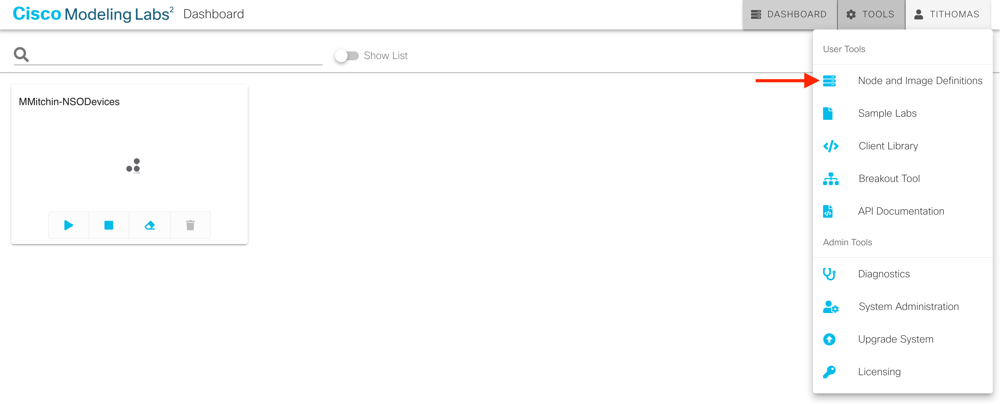
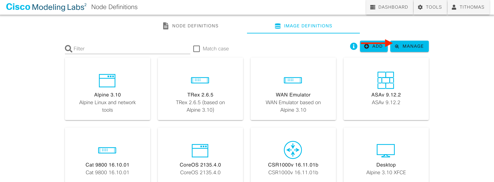
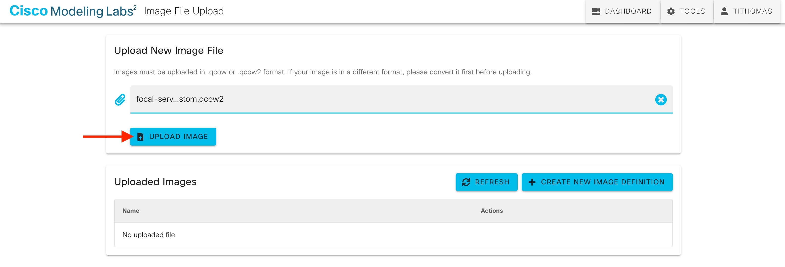
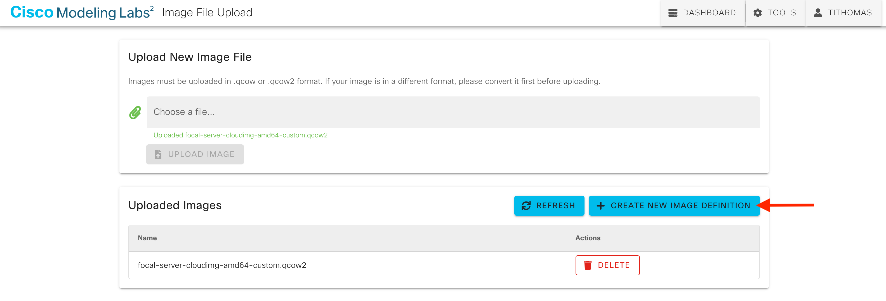
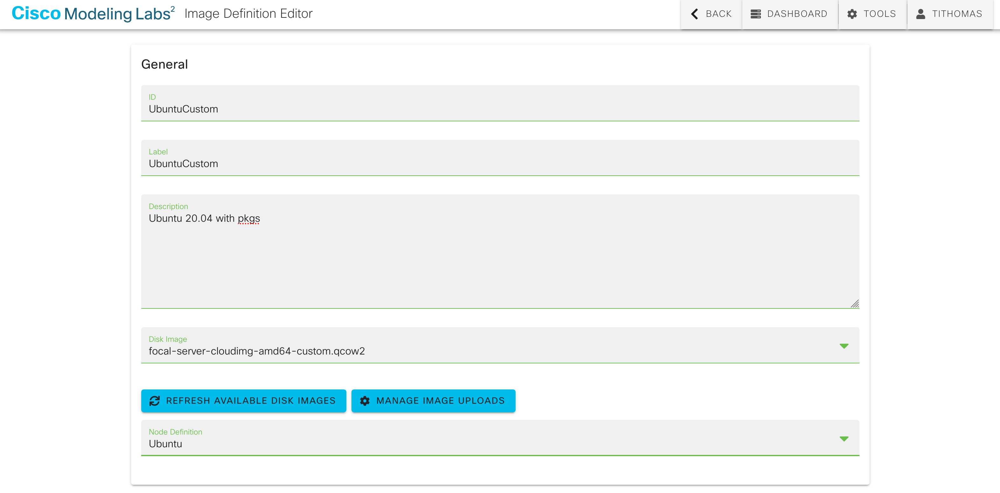
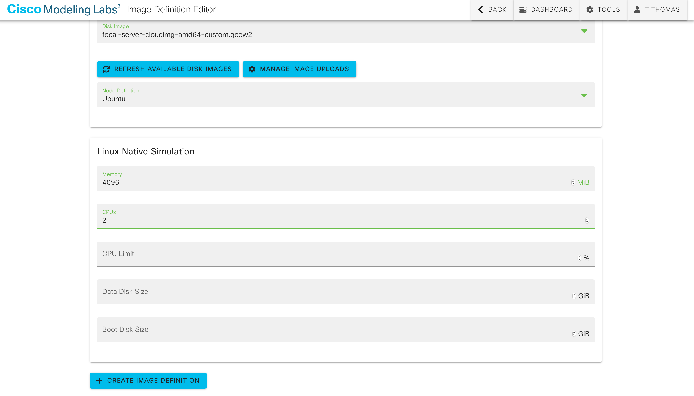
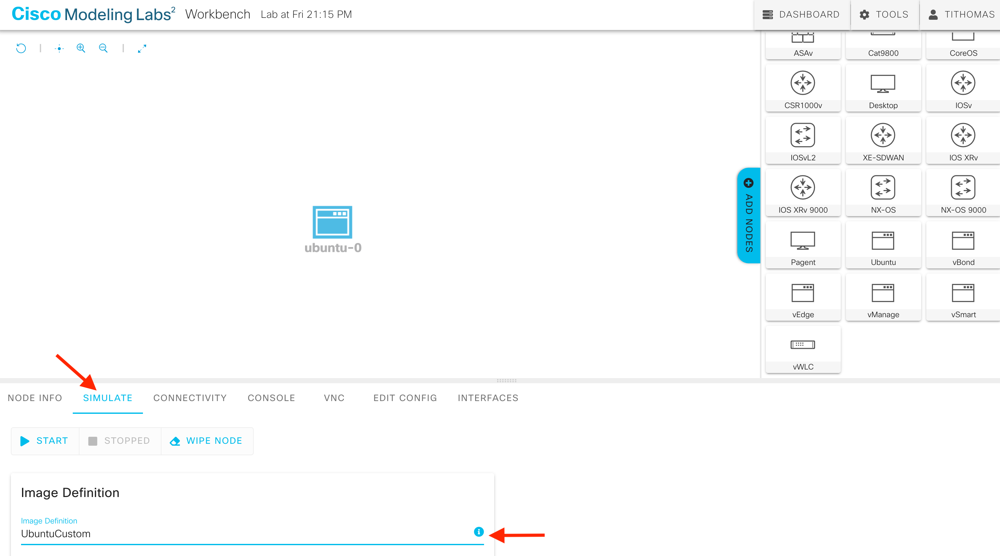
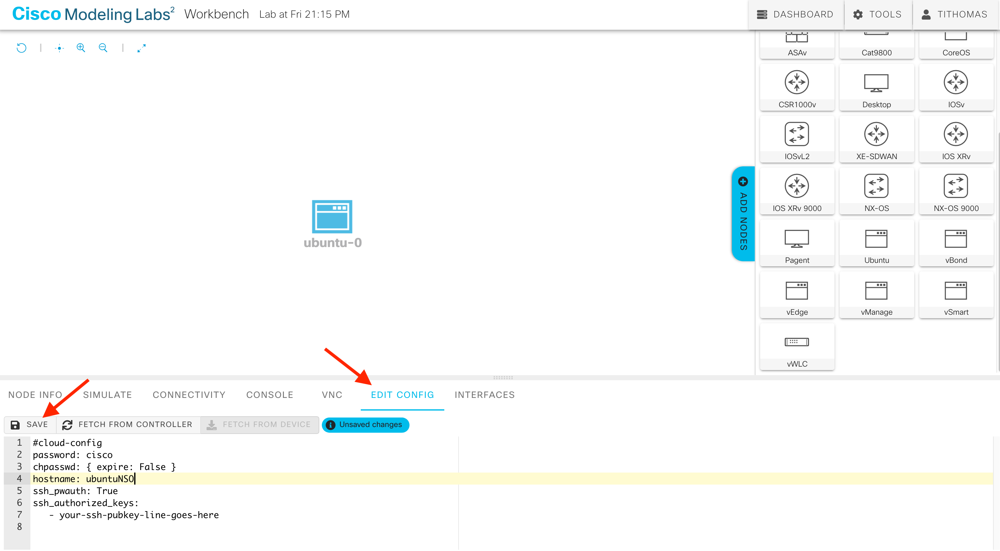

# CML2 custom images

Cisco Modeling Labs version 2 comes with a standard image repository which includes a "vanilla" Ubuntu cloud
image. You can do some customization of a lab instance created from that image using the ```cloud-config``` YAML
in the node's "Edit Config" tab. However, there may be cases where you would like to use a prebuilt customized
image with preinstalled software packages, pre-staged files, and/or other custom settings.

This repo contains HashiCorp Packer image definitions which can be used to create a couple of useful custom
images, namely for adding Cisco's Network Services Orchestrator and Netbox to a CML lab simulation. There is
also a guide which walks through an alternate approach to manually building and testing custom images.

- [Using Packer](#packer-approach)
- [Manual process](#manually-building-images)

# Packer approach

[Packer](https://www.packer.io/) is a widely-used tool that is great for automating the build of machine images. We
have used a qemu/KVM Builder in the provided files, mainly because CML2 also uses KVM.

## Packer build prerequisites

- [Packer 1.7.0+](https://www.packer.io/downloads) for HCL2 support
- qemu/KVM build system (or something else if you want to go to the effort of changing the Builder used in the provided files)

## Packer build for Cisco's Network Services Orchestrator (NSO)
1. [Download](http://cloud-images.ubuntu.com/focal/current/focal-server-cloudimg-amd64.img) the current Ubuntu 20.04
   cloud image to [./packer_nso](./packer_nso) directory
2. Determine the current focal-server-cloudimg-amd64.img SHA256 [hash](http://cloud-images.ubuntu.com/focal/current/SHA256SUMS)
3. [Download](https://developer.cisco.com/docs/nso/#!getting-and-installing-nso) the NSO 5.5 Linux evaluation copy
    - Copy the '.signed.bin' file to [./packer_nso/installResources](./packer_nso/installResources)
4. [Download](https://developer.cisco.com/docs/nso/#!getting-and-installing-nso) the Cisco IOS, XR, NXOS, and ASA Network Element Drivers (NEDs)
    - Copy the NED '.signed.bin' files to [./packer_nso/installResources](./packer_nso/installResources)
5. Edit [./packer_nso/local-nso-5.5.pkrvars.hcl](./packer_nso/local-nso-5.5.pkrvars.hcl)
    - Update the SHA256 hash for your downloaded focal-server-cloudimg-amd64.img
    - Add the NED filenames to the ```nso_ned_list``` variable
6. Validate the Packer configuration
    ```commandline
    packer validate -var-file=local-nso-5.5.pkrvars.hcl nso.pkr.hcl
    ```
7. Build the image
    ```commandline
    packer build -var-file=local-nso-5.5.pkrvars.hcl nso.pkr.hcl
    ```

Once the build is finished, you can upload the NSO QCOW2 image from the output folder into CML and
create a new image definition using 'Ubuntu' for the underlying node definition. We strongly recommend
giving the new NSO image definition at least 8GB of memory and 4 vCPUs (a real operational deployment
of NSO would typically require more).

## Packer build for Netbox
Note the script in [./packer_netbox/scripts/installNetbox.sh](./packer_netbox/scripts/installNetbox.sh) follows instructions
from [https://netbox.readthedocs.io/en/stable/installation/](https://netbox.readthedocs.io/en/stable/installation/)

1. [Download](http://cloud-images.ubuntu.com/focal/current/focal-server-cloudimg-amd64.img) the current Ubuntu 20.04
   cloud image to [./packer_netbox](./packer_netbox) directory
2. Get the current focal-server-cloudimg-amd64.img SHA256 [hash](http://cloud-images.ubuntu.com/focal/current/SHA256SUMS)
3. Edit [./packer_netbox/local-netbox.pkrvars.hcl](./packer_netbox/local-netbox.pkrvars.hcl)
    - Update the SHA256 hash for your downloaded focal-server-cloudimg-amd64.img
4. Validate the Packer configuration
    ```commandline
    packer validate -var-file=local-netbox.pkrvars.hcl netbox.pkr.hcl
    ```
5. Build the image
    ```commandline
    packer build -var-file=local-netbox.pkrvars.hcl netbox.pkr.hcl
    ```

Once the build is finished, you can upload the Netbox QCOW2 image from the output folder into CML and
create a new image definition using 'Ubuntu' for the underlying node definition. We strongly recommend
giving the new Netbox image definition at least 2GB of memory and 1 vCPU.


# Manually building images

Note I have only used this process to create custom Ubuntu images, so your "mileage may vary" if you try to do this for
anything else. As an example, you might want an Ubuntu image with Cisco's NSO (Network Services Orchestrator) software
installed with all of its software dependencies.

- [Build System](#build-system)
- [Prerequisites](#prerequisites)
- [Base image](#base-image)
- [Add more space to the image if needed](#add-more-space-if-needed)
- [Installing software packages and files](#installing-software-packages-and-files)
- [Prep the image](#prep-the-image)
- [Test the image on the build system](#test-the-image-on-the-build-system)
- [Upload the new image to CML](#upload-the-new-image-to-cml)
- [Creating CML lab instances with the new definition](#creating-cml-lab-instances-with-the-new-definition)

## Build system

To start, you need an image "builder" system. I used an Ubuntu 20.04 VM, although the same basic steps should work
with any Linux system. You could conceivably use the CML2 system itself (which is currently based on CentOS 8), but I
would NOT recommend it. CML2 uses KVM for virtualization under the covers, but you would need to install some additional
software packages from an admin shell.

The rest of this document assumes an Ubuntu 20.04 build system. The system should have a reasonable amount of free disk
space, say at least 20GB+, depending on how big your custom images might get. I would also recommend at least 4-8GB
of memory and at least two vCPUs if you are using a VM.

If you are using a VM for your build system, make sure it has nested virtualization enabled running on an Intel CPU
with VT-x/EPT support or an AMD CPU with AMD-V/RVI support. Note KVM 4.2 has an MSR issue with nested virtualization on
AMD CPUs, which I believe is fixed in the Linux 5.8 kernel.

The checkbox to enable nested virtualization can be found under the VM's CPU settings in VMware. You can verify the
support is enabled from within the build VM itself:
```commandline
egrep -c '(vmx|svm)' /proc/cpuinfo    # The result of this should be non-zero (and equal to the number of vCPUs)
```
Also:
```commandline
sudo apt install cpu-checker && sudo kvm-ok
```

## Prerequisites

Install the required software packages needed on the build system
```commandline
sudo apt install -y --no-install-recommends libguestfs-tools qemu-utils virtinst
```

I highly recommend testing your custom images with KVM on the build system before importing them into CML. To do
that, some additional packages are required:
```commandline
sudo apt install -y --no-install-recommends qemu-kvm libvirt-clients libvirt-daemon-system cloud-image-utils bridge-utils virt-manager dnsmasq
```

## Base image

Once you have your build system ready, grab a current cloud image to use as the basis for customization. In this example
we will start with an Ubuntu 20.04 "Focal Fossa" 64-bit image:
```commandline
wget http://cloud-images.ubuntu.com/focal/current/focal-server-cloudimg-amd64.img
```
Check out the image details:
```commandline
❯ qemu-img info focal-server-cloudimg-amd64.img
image: focal-server-cloudimg-amd64.img
file format: qcow2
virtual size: 2.2 GiB (2361393152 bytes)
disk size: 522 MiB
cluster_size: 65536
Format specific information:
    compat: 0.10
    refcount bits: 16
```
From the output you can see the image uses the QCOW2 (QEMU copy-on-write version 2) format for virtual disks. You can
also see the disk is virtually 2.2GB in size, but the actual size of the image file is smaller at 522MB. A QCOW2 image
supports a sparse format (thin-provisioned) where space in the underlying image is only allocated if it is actually
being used.

## Add more space if needed

The base cloud image has some free space in its filesystem, but it is not a lot:
```commandline
❯ virt-df -h focal-server-cloudimg-amd64.img
Filesystem                                Size       Used  Available  Use%
focal-server-cloudimg-amd64.img:/dev/sda1
                                          2.0G       1.2G       766M   62%
focal-server-cloudimg-amd64.img:/dev/sda15
                                          104M       3.9M       100M    4%
```
This shows about 766MB available. You can also see the virtual disk partition info:
```commandline
❯ virt-filesystems --long --parts --blkdevs -h -a focal-server-cloudimg-amd64.img
Name        Type       MBR  Size  Parent
/dev/sda1   partition  -    2.1G  /dev/sda
/dev/sda14  partition  -    4.0M  /dev/sda
/dev/sda15  partition  -    106M  /dev/sda
/dev/sda    device     -    2.2G  -
```
If, for example, you need to install the default JRE/JDK and/or Python (like for NSO), then you will need more space.
To add more space, you first need to create a new image that has the target size you think you might need (or larger).
Here we will create a new QCOW2 image with a total of 6GB of space:
```commandline
❯ qemu-img create -f qcow2 focal-server-cloudimg-amd64-custom.qcow2 6G
```
Now copy the base image over to the new image and resize its filesystem in the process:
```commandline
virt-resize --expand /dev/sda1 --align-first never focal-server-cloudimg-amd64.img focal-server-cloudimg-amd64-custom.qcow2
```
The ```--align-first never``` might slightly impact the performance of VMs created from the image, but it will
give a greater chance of having an image that actually boots. The default alignment option is "auto".

The disk and filesystem are now larger, but the copy process has rendered the new virtual disk unbootable. To fix that,
do the following to write a new bootloader into the image:
```commandline
guestfish -a focal-server-cloudimg-amd64-custom.qcow2 -m /dev/sda3:/ <<EOF
sh "grub-install /dev/sda"
exit
EOF
```
Or you could use ```virt-rescue```, but you have to manually issue the following commands:
```commandline
virt-rescue focal-server-cloudimg-amd64-custom.qcow2

mkdir /mnt
mount /dev/sda3 /mnt
mount --bind /dev /mnt/dev
mount --bind /proc /mnt/proc
mount --bind /sys /mnt/sys
chroot /mnt

grub-install /dev/sda

exit
exit
```

The new image should now be bootable.

## Installing software packages and files

Installing one or more packages is easy using ```virt-customize```:
```commandline
virt-customize -a focal-server-cloudimg-amd64-custom.qcow2 --install <package list>
```
For example, NSO requires several packages:
```commandline
virt-customize -a focal-server-cloudimg-amd64-custom.qcow2 --install default-jre,openssh-client,python3,ant,make,libxml2-utils,xsltproc
```
This command can take several minutes to run, depending on the number and/or size of the packages you want to install.

If needed, ```virt-customize``` supports other operations such as running commands, creating symbolic links, appending
to files, and copying files into the image, maybe to pre-stage other software installers or config files. Here is
an example taken from a script used for installing NSO:
```commandline
virt-customize -a $workingImage \
  --copy-in nso-${nsoVer}.linux.x86_64.installer.bin:/ \
  --mkdir $installDirectory \
  --link /usr/bin/python3:/usr/bin/python \
  --run-command "sh /nso-${nsoVer}.linux.x86_64.installer.bin $installDirectory --local-install" \
  --run-command "chmod go+r ${installDirectory}/netsim/confd/etc/confd/ssh/ssh_host_rsa_key" \
  --run-command "chmod go+r ${installDirectory}/etc/ncs/ssh/ssh_host_ed25519_key" \
  --run-command "rm -rf ${installDirectory}/{doc,man}" \
  --run-command "rm /nso-${nsoVer}.linux.x86_64.installer.bin" \
  --append-line "/etc/skel/.bashrc:source ${installDirectory}/ncsrc" \
  --append-line "/etc/skel/.bashrc:export NCS_JAVA_VM_OPTIONS=\"${javaOpts}\"" \
  --copy-in ${tmpMotd}:/etc
```

## Prep the image

At this point you need to clean up the image with ```virt-sysprep``` to prepare it for cloning. For example,
```virt-customize``` in the previous step seeded the machine-id, something which should be removed to make the image
more generalized.

```virt-sysprep``` supports quite a few operations:
```commandline
virt-sysprep --list-operations
```
If you only used ```virt-customize``` above, you likely only need to remove the machine-id:
```commandline
virt-sysprep -a focal-server-cloudimg-amd64-custom.qcow2 --operations machine-id
```
If you did more, say trying to create a generalized image from a previously-booted VM, you probably need to include the
```ssh-hostkeys,net-hwaddr,dhcp-client-state,user-account``` operations as well.

Finally, you should remove freed blocks from the OS filesystem and collapse the image backing chain into a
single standalone image. As a word of caution, this step can temporarily consume a large amount of
storage space on your build system as ```virt-sparsify``` processes the source image to create a new copy.
```commandline
virt-sparsify --format qcow2 --compress focal-server-cloudimg-amd64-custom.qcow2 focal-server-cloudimg-amd64-custom-sparse.qcow2
```
At this point it _should_ be safe to overwrite your custom image with the newly-created sparse version:
```commandline
mv -f focal-server-cloudimg-amd64-custom-sparse.qcow2 focal-server-cloudimg-amd64-custom.qcow2
```

## Test the image on the build system

As mentioned at the start, it is a good idea to try creating a VM from the new image to make sure it works. Note you
need to have the additional KVM-related packages mentioned in the [Prerequisites](#prerequisites) section. There is
likely an easier way to do this, but I think it is instructive to walk through the required steps in more detail.

First, establish a base KVM image repository if it is not there already:
```commandline
sudo mkdir /var/lib/libvirt/images/base/
```
Copy your custom image to the base repository directory:
```commandline
sudo cp focal-server-cloudimg-amd64-custom.qcow2 /var/lib/libvirt/images/base/
```
Create a directory to hold the test instance disk image files:
```commandline
sudo mkdir /var/lib/libvirt/images/test-1/
```
Create a new instance disk using the custom image as the backing file:
```commandline
sudo qemu-img create -f qcow2 -F qcow2 -o backing_file=/var/lib/libvirt/images/base/focal-server-cloudimg-amd64-custom.qcow2 /var/lib/libvirt/images/test-1/test-1.qcow2
```
If needed, you can resize the instance disk to be larger than the custom base image, maybe to get extra space
for logs or other generated data. Ubuntu will resize its filesystem to fill the space when it first boots (which is
different from what we had to do above to potentially add more space to an existing virtual disk image for
```virt-customize```). As an example, we will add an additional 5GB to the instance disk:
```commandline
sudo qemu-img resize /var/lib/libvirt/images/test-1/test-1.qcow2 +5G
```
You can see the additional virtual space has been added, but the size of the actual disk image is initially very
small compared to the base backing image:
```commandline
❯ sudo qemu-img info --backing-chain /var/lib/libvirt/images/test-1/test-1.qcow2
image: /var/lib/libvirt/images/test-1/test-1.qcow2
file format: qcow2
virtual size: 11 GiB (11811160064 bytes)
disk size: 200 KiB
cluster_size: 65536
backing file: /var/lib/libvirt/images/base/focal-server-cloudimg-amd64-custom.qcow2
backing file format: qcow2
Format specific information:
    compat: 1.1
    lazy refcounts: false
    refcount bits: 16
    corrupt: false

image: /var/lib/libvirt/images/base/focal-server-cloudimg-amd64-custom.qcow2
file format: qcow2
virtual size: 6 GiB (6442450944 bytes)
disk size: 1.28 GiB
cluster_size: 65536
Format specific information:
    compat: 1.1
    lazy refcounts: false
    refcount bits: 16
    corrupt: false
```
The instance disk image will increase in size as the instance boots and the "copy on write" mechanism kicks in.

Create a new SSH key to use with the instance:
```commandline
ssh-keygen -t ed25519 -f ./id_ed25519
export PUB_KEY=$(cat ./id_ed25519.pub)
```
Now we need some _cloud-init_ NoCloud data to feed the instance on boot. That consists of two files, a ```meta-data```
file and a ```user-data``` file. The ```meta-data``` can be used to set the instance name and/or host name.
```commandline
cat > meta-data <<EOF
local-hostname: test-1
EOF
```
The ```user-data``` can have all sorts of [_cloud-init_ configuration options](https://cloudinit.readthedocs.io/en/latest/topics/modules.html).
As an example, here we will create two users, the default 'ubuntu' user and a 'cisco' user using the top-level
```chpasswd``` key (from the 'Set Passwords' module) to give both a password of 'cisco123'. Note the default 'ubuntu'
user's default password is 'ubuntu' if you do not change it. Add the generated SSH public key to the 'cisco' user
and give ```sudo``` access. Obviously this configuration is highly insecure, but good for showing how you can customize
various user settings. Notice the environment variable reference to fill in the public SSH key:
```commandline
cat > user-data <<EOF
#cloud-config
chpasswd:
  expire: False
  list:
    - ubuntu:cisco123
    - cisco:cisco123
ssh_pwauth: True
users:
  - default
  - name: cisco
    ssh-authorized-keys:
      - $PUB_KEY
    sudo: ['ALL=(ALL) NOPASSWD:ALL']
    groups: sudo
    shell: /bin/bash
runcmd:
  - echo "AllowUsers cisco" >> /etc/ssh/sshd_config
  - service ssh restart
EOF
```
Bundle those two files together into an ISO image to attach to the instance on boot:
```commandline
sudo cloud-localds /var/lib/libvirt/images/test-1/test-1-cidata.iso user-data meta-data
```
For networking, there is a ```default``` virtual switch created for you providing DHCP and NAT (PAT) with the
rest of the network. You can get the details from the ```default``` network instance. Note you can add static DHCP
host mappings to this switch using instance names, but we will not go into that here.
```commandline
❯ sudo virsh net-dumpxml default
<network>
  <name>default</name>
  <uuid>99bf0d08-6d61-440b-b02c-5cc19d042e2d</uuid>
  <forward mode='nat'>
    <nat>
      <port start='1024' end='65535'/>
    </nat>
  </forward>
  <bridge name='virbr0' stp='on' delay='0'/>
  <mac address='52:54:00:bb:92:bb'/>
  <ip address='192.168.122.1' netmask='255.255.255.0'>
    <dhcp>
      <range start='192.168.122.2' end='192.168.122.254'/>
    </dhcp>
  </ip>
</network>
```
Finally create the instance, attaching the main disk image, the _cloud-init_ NoCloud ISO image, and connecting it
to the ```default``` network:
```commandline
sudo virt-install --virt-type kvm --name test-1 --ram 2048 --vcpus 1 \
  --os-type linux --os-variant ubuntu20.04 \
  --disk path=/var/lib/libvirt/images/test-1/test-1.qcow2,format=qcow2 \
  --disk /var/lib/libvirt/images/test-1/test-1-cidata.iso,device=cdrom \
  --import --network network=default --noautoconsole
```
You can watch the instance boot through its console:
```commandline
sudo virsh console test-1
```
Make sure you wait until the _cloud-init_ process fully completes, which can take up to 30 seconds or so after
you see a login prompt. Now you can login here as either the 'ubuntu' or 'cisco' users created by _cloud-init_. When
done, detach from the console with Ctrl-].

If you want to try SSH, see what address the instance grabbed from the ```default``` network DHCP pool:
```commandline
❯ sudo virsh net-dhcp-leases default
 Expiry Time           MAC address         Protocol   IP address           Hostname   Client ID or DUID
------------------------------------------------------------------------------------------------------------------------------------------------
 2020-10-09 20:58:43   52:54:00:92:68:1a   ipv4       192.168.122.156/24   test-1     ff:56:50:4d:98:00:02:00:00:ab:11:de:d5:40:7f:da:c9:86:e6
```
Given the address, SSH in as the 'cisco' user and check things out. There is no need to remember the test instance as
a known host:
```
ssh -o 'UserKnownHostsFile /dev/null' -o StrictHostKeyChecking=no -i ./id_ed25519 cisco@192.168.122.156
```

When you are done, exit and shutdown the instance:
```commandline
❯ sudo virsh shutdown test-1
Domain test-1 is being shutdown
```
Wait for the instance to disappear from the list and then clean up the instance directory:
```commandline
❯ sudo virsh list
 Id   Name   State
--------------------

❯ sudo virsh undefine test-1
Domain test-1 has been undefined

❯ sudo rm -rf /var/lib/libvirt/images/test-1
```

## Upload the new image to CML

Now that the custom image is built (and hopefully validated on the build system using a KVM test instance),
it is time to upload it to a CML2 server. CML2 is using KVM behind the scenes, so it _should_ just work.

You can upload the image through CML2's API, its web interface, or via its "Cockpit" web/CLI interface. To upload
through the web interface, the file needs to be local to where you are running the browser, likely your laptop.
You could simply ```scp``` the image to your laptop from the build system. If the image is very large, it might
make more sense to transfer it directly from the build system to the CML server using the available
[virlutils](https://github.com/CiscoDevNet/virlutils). You could even transfer the image in from a shell in the
CML Cockpit interface, copying it to the ```/var/local/virl2/dropfolder/``` directory.

For the standard web interface, you will need admin access. Go to "TOOLS" -> "Node and Image Definitions":



Then click the "MANAGE" button from the "IMAGE DEFINITIONS" tab at the top:



Click in the top box to select the local copy of the image and then click the "UPLOAD IMAGE" button:



Once uploaded, the image should appear in the "Uploaded Images" list. Then click "CREATE NEW IMAGE DEFINITION":



On the "Image Definition Editor" page, give your new definition an appropriate id, tag, and description and
select the uploaded image from the "Disk Image" list (note you might have to "REFRESH AVAILABLE DISK IMAGES"):



Use "Ubuntu" for the node definition (unless you have created another one). Under "Linux Native Simulation" pick
an appropriate amount of memory (in MB) and some number of CPUs to allocate by default:



Do NOT put anything in the "Data Disk Size" or "Boot Disk Size" boxes. Then click "Create Image Definition" at
the bottom. Your new image should now show up in the "IMAGE DEFINITIONS" list.

## Creating CML lab instances with the new definition

With your new image defined on the server, create a lab instance from the Dashboard. Drag a new Ubuntu node
onto the canvas from the "ADD NODES" palette and select that node. Under the node's "SIMULATE" tab, select
your custom image definition from the list:



Notice the node has been given the memory and CPU settings from the image definition, but CML uses a "Boot
disk size" of 64GB by default.

Finally, you may want to tweak the _cloud-init_ settings under the "EDIT CONFIG" tab. It's the equivalent of
the ```user-data``` we created back in the [Test your image](#test-the-image-on-the-build-system) section.
Remember to save any changes!


